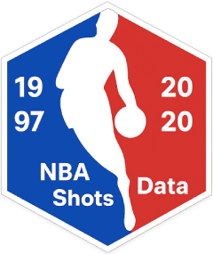
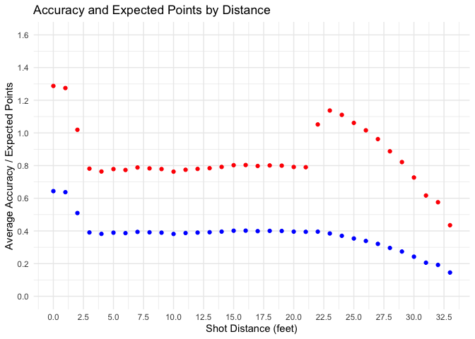

<!-- README.md is generated from README.Rmd. Please edit that file -->

# asg4nbashots <a href="https://github.com/ETC5523-2025/assignment-4-packages-and-shiny-apps-mozuqi25"></a>

<!-- badges: start -->

[](https://www.r-project.org/)
[](https://etc5523-2025.github.io/assignment-4-packages-and-shiny-apps-mozuqi25/)
[](LICENSE)
<!-- badges: end -->

`asg4nbashots` package provides cleaned **NBA Shot Data (1997–2020)**,
including shot types, distances, court zones, outcomes, and season
context, plus a bundled Shiny app for interactive exploration and
visualisation.

This package was inspired by the Stand-up Maths video **“[We analysed
4,678,387 NBA shots](https://www.youtube.com/watch?v=yh5c3duQQ1w)”**.

The video does not publish a dataset or cleaning pipeline, hence this
package uses a public dataset on
[data.world/sportsvizsunday](https://data.world/sportsvizsunday/june-2020-nba-shots-1997-2019)
covering a similar period and variables. After cleaning and
standardisation, the resulting dataset contains **~4.7 million** rows
(slightly more than the 4.68M mentioned in the video), likely due to
source compilation or filtering differences.

### Key features

- 🏀 **Comprehensive dataset:** over 4.7 million shot attempts with 11
  variables including  
  `shot_distance`, `x_location`, `y_location`, `shot_type`,
  `shot_made_flag`, and `game_date`
- 💡 **Interactive app:** launch with `run_nbashots_app()` to explore
  accuracy and expected-points trends
- 📚 **Documentation:** includes help pages, a vignette, and a pkgdown
  website

**Pkgdown site:**
<https://etc5523-2025.github.io/assignment-4-packages-and-shiny-apps-mozuqi25/>

## Installation

You can install the `asg4nbashots` package from GitHub using `remotes`:

``` r
# install.packages("remotes")
remotes::install_github("ETC5523-2025/assignment-4-packages-and-shiny-apps-mozuqi25")

# Load the package
library(asg4nbashots)
```

After installation, you can load the package and explore the dataset or
launch the Shiny app:

## Quick Start

After installing and loading the package, you can start exploring the
dataset or run the interactive Shiny app.

``` r
# Load the packaged dataset
data("nba_shots")

# Take a quick look at the data
dplyr::glimpse(nba_shots)

# Launch the Shiny app (opens in Viewer or web browser)
run_nbashots_app()
```

This example demonstrates how users can reproduce analyses similar to
those discussed in Assignments 1, including exploratory visualisation,
data cleaning, and interactive communication of insights.

This app allows you to explore shot accuracy, distance patterns, and
expected points interactively across all seasons.

## What’s in the Data?

The `nba_shots` dataset contains detailed shot-level information from
NBA games between 1997 and 2020.  
Each row represents one shot attempt.

| Variable | Type | Description |
|----|----|----|
| `action_type` | Factor | Type of shot action (e.g., Jump Shot, Layup, Dunk). |
| `shot_distance` | Integer | Distance of the shot attempt, in feet. |
| `shot_zone_basic` | Factor | Broad shot zone category (e.g., Restricted Area, Mid-Range, Left Corner 3). |
| `shot_zone_area` | Factor | Court area where the shot occurred (Left, Center, Right). |
| `shot_zone_range` | Factor | Distance range (e.g., Less Than 8 ft., 8–16 ft., 16–24 ft., 24+ ft.). |
| `x_location` | Integer | X-coordinate of the shot on the court. |
| `y_location` | Integer | Y-coordinate of the shot on the court. |
| `shot_type` | Integer | Shot value (2 or 3 points). |
| `shot_made_flag` | Integer | 1 if the shot was made, 0 if missed. |
| `game_date` | Date | Date of the game (YYYY-MM-DD). |
| `season_type` | Factor | Season type (Regular Season or Playoffs). |

The dataset is stored in a compressed `.rda` file
(`data/nba_shots.rda`),  
with a size of approximately **18.8 MB**, enabling efficient loading
while preserving full detail.

``` r
data("nba_shots")
```

## Example: Accuracy and Expected Points by Distance

This example illustrates how to calculate two common performance
metrics:

- **Accuracy**: the percentage of made shots at each distance  
- **Expected points**: the average points scored per attempt, based on
  shot success and shot type (2 or 3-point)

``` r
library(dplyr)
library(ggplot2)

# Compute accuracy and expected points by distance
summary_df <- nba_shots %>%
  group_by(shot_distance) %>%
  summarise(
    accuracy = mean(shot_made_flag),
    expected_points = mean(shot_type * shot_made_flag),
    .groups = "drop"
  )

# Plot both metrics
ggplot(summary_df, aes(x = shot_distance)) +
  geom_point(aes(y = accuracy), color = "blue") +
  geom_point(aes(y = expected_points), color = "red") +
  scale_x_continuous(limits = c(0, 33), breaks = seq(0, 33, by = 2.5)) +
  scale_y_continuous(limits = c(0, 1.6), breaks = seq(0, 1.6, by = 0.2)) +
  labs(
    title = "Accuracy and Expected Points by Distance",
    x = "Shot Distance (feet)",
    y = "Average Accuracy / Expected Points"
  ) +
  theme_minimal()
```



The blue points represent the average **shot accuracy** at each
distance, while the red points show the **expected points per attempt**
— capturing the value of longer shots as 3-pointers become more
frequent.

## Reproducibility and Data Size

- The **original raw CSV file** contains more than 4.7 million rows and
  is **857 MB** in size.  
  It is **not included in this repository** due to GitHub’s file size
  limits and best practice for package distribution.

- The package instead provides a **cleaned and compressed dataset**
  (`data/nba_shots.rda`),  
  which is only around **18.8 MB**, for faster loading and easier
  sharing.

- The full data-cleaning and preparation process is documented in  
  `data-raw/nba_shots.R`, ensuring full reproducibility.

- If you need the full CSV version, you can follow the data source link
  and detailed steps  
  provided in the **vignette** or the **pkgdown** documentation website.

This design keeps the package lightweight while preserving data
transparency.

## Vignette and Documentation

A vignette is included in the package to demonstrate how to explore,
visualise,  
and interpret the NBA shot data using both static plots and the Shiny
app.

You can open it directly in R with:

``` r
browseVignettes("asg4nbashots")
```

All documentation, including dataset details, functions, and vignettes,
is also available through the package website (built with **pkgdown**):
<https://etc5523-2025.github.io/assignment-4-packages-and-shiny-apps-mozuqi25/>

This site provides a structured overview of your data, functions, and
example analyses.

## Contributing

Contributions, feedback, and suggestions are always welcome!  
If you notice a data issue, find a bug, or have an idea for improvement,
please open an issue or pull request on the project’s GitHub page:

🔗
<https://github.com/ETC5523-2025/assignment-4-packages-and-shiny-apps-mozuqi25>

## License

This package is released under the **MIT License**.  
You are free to use, modify, and distribute it with attribution.

© **Mohammad Zulkifli Falaqi**, 2025  
Part of the *ETC5523 - Communicating With Data* unit *Assignment 4*.
